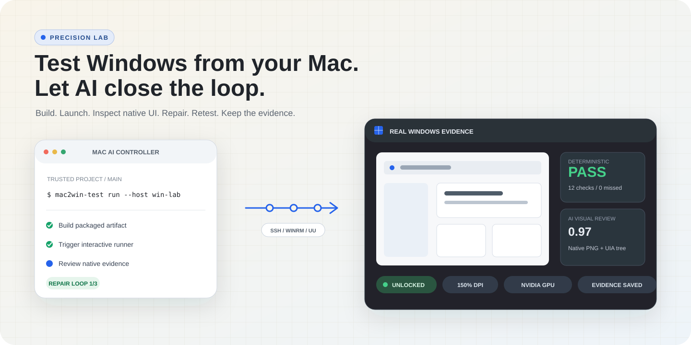
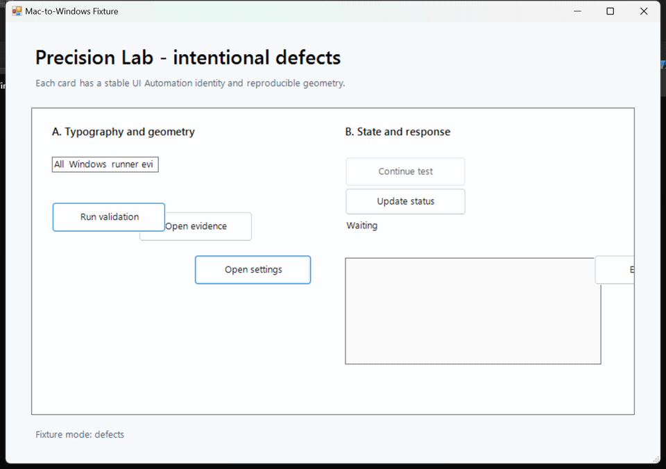

<div align="center">

# Mac-to-Windows Testing Skill

**让 Mac 上的 AI 自动连接真实 Windows 电脑，构建、启动、操作、检查 UI、修复并复测。**

[English](README.md) · [快速开始](#60-秒开始) · [安全边界](#默认安全) · [配置说明](skills/mac-to-windows-testing/references/CONFIGURATION.md)

[](https://github.com/wimi321/mac-to-windows-testing-skill/actions/workflows/ci.yml)
[](https://github.com/wimi321/mac-to-windows-testing-skill/releases)
[](LICENSE)
[](#通过标准)

<picture>
  <source media="(prefers-color-scheme: dark)" srcset="assets/hero-dark.svg">
  <source media="(prefers-color-scheme: light)" srcset="assets/hero-light.svg">
  
</picture>

</div>

## 它解决什么问题

Mac 开发者即使在 CI 里成功构建 Windows 程序，仍然可能漏掉用户真正遇到的问题：内置 JVM 启动失败、150% 缩放下文字裁切、弹窗被主窗口遮住、GPU 真机才会触发的错误，或者按钮看得见却点了没反应。

这个 Skill 让 Codex、Claude Code、OpenCode 或 GitHub Copilot 可以连接到一台**已解锁、处于交互桌面的真实 Windows 电脑**。完成一次设备授权后，后续测试不再要求人逐张截图确认，AI 会自己执行、取证、判断、修复和复测。

```text
Mac 源码 + AI
  -> 受信任的测试清单
  -> SSH / WinRM / UU + Computer Use / Windows 端 AI
  -> Windows 交互式 Runner
  -> 原生截图 + UI Automation 控件树 + 日志 + 环境信息
  -> AI 视觉判定
  -> 定向修复 -> 失败场景复测 -> 完整回归
```

最终结果只能是 `PASS`、`FAIL` 或 `BLOCKED`。证据不足绝不会包装成“基本通过”。

<div align="center">
  
  <br>
  <sub>150% 缩放下的 Windows 原生证据：故障模式正确失败，安全探索会清理新窗口，修复后的干净模式通过。</sub>
</div>

## 60 秒开始

先安装到一个 AI 客户端：

```bash
git clone https://github.com/wimi321/mac-to-windows-testing-skill.git
cd mac-to-windows-testing-skill
./install.sh codex       # 也可用 claude、opencode、copilot、agents 或 all
```

安装脚本会把命令链接到 `~/.local/bin/mac2win-test`；如果终端尚未包含该目录，请将 `~/.local/bin` 加入 `PATH`。

进入需要测试的项目：

```bash
mac2win-test init
# 填写已经确认过的 Windows 构建、测试、启动命令和 UI 场景。
mac2win-test doctor --transport ssh --host windows-lab
mac2win-test runner install --transport ssh --host windows-lab
mac2win-test runner trust --transport ssh --host windows-lab
mac2win-test run --transport ssh --host windows-lab
```

首次 Windows 登录、设备授权、SSH/WinRM 配置和项目配置授权需要用户完成一次。之后日常验收和证据判断由 AI 全程完成。

## AI 会检查什么

| 层级 | 证据与检查内容 |
|---|---|
| 构建 | 经过确认的项目命令、正式打包产物、退出码、标准输出和错误输出 |
| 桌面 | 是否已解锁、Windows 版本、DPI、多显示器、GPU、驱动和进程状态 |
| 结构 | UI Automation 控件树、无障碍名称、边界、焦点、启用状态和是否在屏幕外 |
| 交互 | 点击、选择、输入、快捷键和声明的状态变化 |
| 几何 | 控件缺失、重叠、裁切风险、子控件越界、异常空白和窗口层级 |
| 视觉 | Windows 原生截图中的文字裁切、错位、对比度、图标损坏、加载卡住和遮挡 |

自动探索采用保守白名单：只会尝试已识别的导航、Tab、菜单、设置、详情和关于控件。未知动作，以及付款、删除、发布、卸载、重置等危险操作都会自动跳过。

当前 AI 没有图像能力时返回 `BLOCKED_VISION_UNAVAILABLE`；Windows 锁屏时返回 `BLOCKED_DESKTOP_LOCKED`。工具不会根据一段终端日志猜测 UI“应该没问题”。

## 支持的连接方式

| 方式 | 远程命令 | 原生 UI | 适用场景 |
|---|---:|---:|---|
| SSH + 交互式 Runner | 支持 | 支持 | 个人 Windows 测试机的默认方案 |
| 已配置的 WinRM + 交互式 Runner | 支持 | 支持 | 受管理的 Windows 环境 |
| UU 远程 + Computer Use | 通过可见远程会话 | 支持 | 不额外开放入站端口 |
| Windows 端 AI | 本地执行 | 支持 | Mac 无法建立远程命令通道时 |

UU CLI 可以发现设备、发起连接和打开远程终端，但不能被误当成通用远程命令和文件传输 API。没有 Computer Use、SSH、WinRM 或具备视觉能力的 Windows 端 AI 时，正确结果是 `BLOCKED_AUTOMATION_CHANNEL`。

## 面向桌面应用

[`examples/`](examples/) 提供可直接改造的配置：

- LizzieYzy Next：真实大型 Swing 应用样例，覆盖动态标题匹配和交互图发现。
- Java Swing：直接读取 Java Access Bridge 控件树，并检查内置 JVM、弹窗层级、菜单、EDT 响应、字体和 DPI。
- Electron：首帧、渲染/GPU 进程、原生弹窗和打包资源路径。
- Tauri：WebView2、原生命令、文件对话框、窗口装饰和更新器。
- .NET：WinForms/WPF 缩放、运行时架构、无障碍和独立发布。
- 通用 Windows 桌面程序：稳定的无障碍选择器和原生证据检查点。

## 通过标准

只有同时满足以下条件，结果才可以是 `PASS`：

1. 声明的构建和测试命令通过。
2. 正式打包程序在 Windows 上启动并保持响应。
3. 所有必测场景完成。
4. 确定性 UI 断言通过。
5. 每个通过场景都有被 AI 明确审阅的 Windows 原生 PNG 及该场景声明的对应控件树。
6. AI 视觉审查达到配置的置信度门槛。
7. 对外发布前完成证据脱敏。
8. 修复后先记录定向复测，再单独跑一次完整回归。

控制器会在合并确定性结果和视觉结果时强制执行这些规则。即使 AI 给出高置信度 `PASS`，没有原生证据也会降级为 `BLOCKED_EVIDENCE_MISSING`。

## 证据目录

每次运行都独立保存：

```text
.mac-to-windows-testing/runs/<run-id>/
  manifest.json
  environment.json
  result.json
  ai-review.json
  report.md
  logs/
  screenshots/
  ui-trees/
```

仓库内置一个可重复的 WinForms 故障程序，稳定制造文字裁切、控件重叠、越界、禁用、点击无响应和异常空白；干净模式用于验证修复后没有误报。CI 只验证控制器、Schema、安装脚本和 PowerShell 语法，**不会冒充真实 Windows UI 验收**。

在内置的六缺陷基准中，真实 Windows 验收命中了全部 6 项预设缺陷，没有产生额外误报，并在干净模式回归中通过。该数据只代表可复现 Fixture，不代表所有软件上的通用视觉准确率。详见[脱敏证据报告](examples/reports/windows-fixture-150-percent.md)。

首个大型应用验收也已完成：LizzieYzy Next 在真实 Windows 上通过 2,162 项测试、7 个 Java Swing UI 场景、定向修复和独立完整回归，并达到可发布状态。详见[脱敏的 LizzieYzy Next 验收报告](examples/reports/lizzieyzy-next-windows.md)。

## 默认安全

- Runner 使用当前 Windows 用户和交互式计划任务，不安装系统服务。
- 不开放新端口，也不要求管理员权限。
- 项目配置按 SHA-256 完成一次授权后才能执行。
- 付款、发布、卸载、删除、重置等危险操作默认禁止。
- 配置文件不能保存密码、token、私有地址或设备凭据。
- 自动修复只允许修改指定工作树，并受最大轮数限制。
- 除非用户另行明确要求，工具不会推送、合并、发布、付款或删除软件。

登记新项目前请阅读完整的[安全模型](skills/mac-to-windows-testing/references/SECURITY.md)。

## 验证仓库

```bash
./tests/run_tests.sh
python3 scripts/validate_repository.py
```

Windows 上运行：

```powershell
.\tests\Test-PowerShell.ps1
```

这些检查只能证明仓库本身完整；真实 UI 结论仍然必须来自一台已解锁的 Windows 真机。

## 参与贡献

欢迎贡献框架配置、更安全的选择器、确定性布局检查、连接加固和完成脱敏的真实案例。提交前请阅读 [CONTRIBUTING.md](CONTRIBUTING.md)、[SECURITY.md](SECURITY.md) 和[行为准则](CODE_OF_CONDUCT.md)。

项目采用 [MIT License](LICENSE)。
